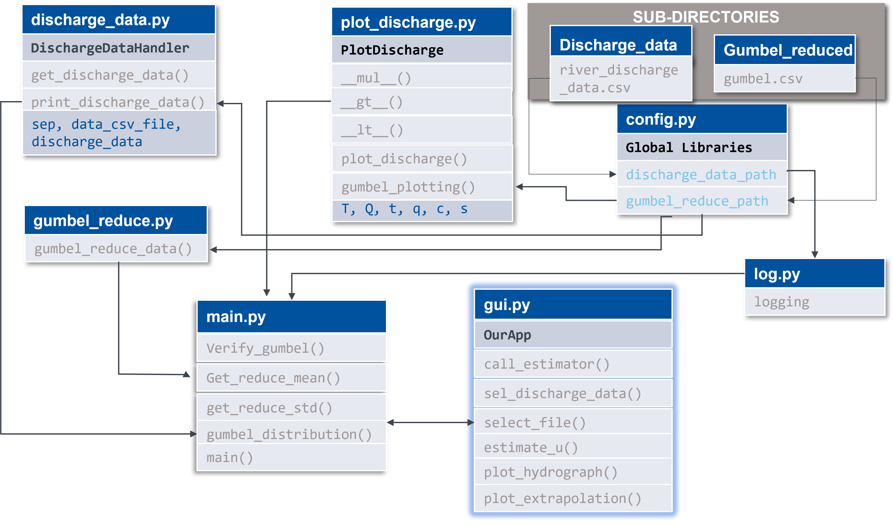

# GUI using python for extrapolation of a Hydrograph


*<sub>The Brahmaputra River in Majuli island, Assam, India (source: Akash Jyoti Handique 2019).</sub>*

***

> ***Background***: Gumbel distribution is used to model the maximum or minimum of samples of various distribution.
Gumbel distribution predicts the chances of an extreme events like floods, earthquakes and other natural calamity.
The ability of the Gumbel distribution to represent the maxima can be used to predict future discharges in a river.

> ***Goal***: To predict 50, 100, 150, 200 and 1000 year flood discharges using Gumbel distribution and showcasing the results in a GUI

GitHub Repository URL
```
https://github.com/aswathCodeX/HASA-Python-Project.git
```

## Theory
### Gumbel Distribution
The Gumbel distribution is named after [Emil Julius Gumbel](https://en.wikipedia.org/wiki/Emil_Julius_Gumbel). Gumbel distribution is a special case of [generalized extreme value distribution](https://en.wikipedia.org/wiki/Generalized_extreme_value_distribution).

The gumbel distribution formula is 
     
*Q = Q<sub>m</sub>.(1+K.C<sub>v</sub>)*
<br>
where
* *Q* = Probable discharge with a return period of T years

* *T* = 50, 100, 150, 200, 500, 1000 years

* *Q<sub>m</sub>* = Mean discharge

* *K* = Frequency factor 
    * *K = (Y<sub>t</sub> - Y<sub>n</sub>) / S<sub>d</sub>*
    * *Y<sub>t</sub> = -ln (ln(T / T-1)*
    * *Y<sub>n</sub>* = Expected Reduce mean of the gumbel distribution
    * *S<sub>d</sub>* = Expected Reduce standard deviation of gumbel distribution


* *C<sub>v</sub>* = Coefficient of variation

     * *C<sub>v</sub> = S<sub>d</sub> / Q<sub>m</sub>*

In order to determine the value of K, from the gumbel reduce table Yn and Sd needs to be extracted

## Data 

### Gumbel reduce table

In the gumbel reduce table possible values of Expected ***mean*** and Expected ***standard deviation*** is given with respect to the amount of data available.

The gumbel reduce data referred to is continuous from the ***10 to 100*** years.
After this, data for ***150 and 200*** years is provided respectively in the table. The reduced data is available in ```.csv``` format

| Number of data | Reduce mean | Reduce std |
|----------------|:------------|-----------:|
| 10             | 0.4952      |     0.9497 |
| 11             | 0.4996      |     0.9676 |
| 12             | 0.5035      |     0.9833 |
| ...            | ...         |        ... |
| 100            | 0.56        |     1.2065 |
| 150            | 0.5646      |     1.2253 |
| 200            | 0.5672      |      1.236 |

### Hydrological data

We have considered Hydrological data for River *Neckar* using the [LUBW Geo-Portal](https://udo.lubw.baden-wuerttemberg.de/public/q/3MD4H4f2pqsu7JaXsrmIRA)
Hydrological data is from ***Obendorf Neckar*** station measuring point ***409*** in Neckar.

Data is available in `.csv` format

| DD-MM-YYYY | Q (m<sup>3</sup>/s) |
|------------|:--------------------|
| 01-11-1929 | 4.086               | 
| 02-11-1929 | 6.326               |
| ...        | ...                 |
| 31-12-2021 | 11.79               |

# Code-Description

## Framework
Functions and  Custom Classes were created as mentioned in following UML Diagram



### Brief Overview of the Components

* ```main.py``` contains 4 functions- ```verify_gumbel()```,```get_reduce_mean()```,```get_reduce_std()```, ```gumbel_distribution()```
* ```discharge_data.py```contains a custom class ```DischargeDataHandler```. This class contains 2 methods and a Magic method
* ```plot_discharge.py```contains a custom class ```PlotDischarge```. This class contains 2 methods and 4 Magic methods
* ```gui.py```
* ```config.py```required packages and modules are imported and the input file paths that are required for the project
* ```log.py```contains logging configuration and initiates the logger
* ```gumbel_reduce.py```contains ```gumbel_reduce()``` function

## Extracting hydrological and gumbel reduce data

```river_discharge_data.csv``` is the input discharge data file that should discharge data. Currently, the Neckar River data used as input is available from the years 1929 to 2021, separated by ```;```

>  Please use this specified format to input different data. Date: `DD-MM-YYY` and Discharge: Q in (m<sup>3</sup>/s)

### discharge_data.py

This file consists of `DisachargeDataHandler`class which has Methods for handling and printing the Discharge Data, Extracting data from user inputted ".csv" file as an argument `data_csv_file` and sorting the data.


### `get_discharge_data()` 

method sorts the data using pandas DataFrame and resampled to annual maxima using `resample(rule='A', kind='period').max()`
Each year is indexed and returned as pandas DataFrame, which includes `Discharge [CMS]` and `Year` columns with maximum annual discharge values in the ```Discharge [CMS]``` column. 

### `print_discharge_data()`

To print the sorted pandas dataframe this method is used.

***
### gumbel_reduce.py

###`gumbel_reduce()`

function takes an argument `csv_file` which is the file path for the gumbel reduce data.
pandas DataFrame is used to sort the data into 3 columns and assign index column to the `Data Index`

### plot_discharge.py

This script contains a custom  class `PlotDischarge` and 6 methods.
Among the methods 4 are magic methods including `__init__`

Aim of the `PlotDischarge` class is to plot the hydrograph for the River Discharge data (Neckar) and the extrapolated discharges for 50, 100, 150, 200, 500, 1000 years.

### `plot_discharge()`

Method takes 4 arguments `time_series`, `q_series`, `title` and `color`

`time_series` and `q_series` have to be pandas DataFrames. `color` and `title` should be strings.

`plot_discharge()` is generating a scatter plot for the annual_max hydrological data. The flexibility on the size of the scatter points are controlled by the **magic methods** `__mul__()`, `__gt__()` and `__lt__()`. 

###`__mul_()` 
Magic method multiplies the scatter points size by a factor of 10. `__mul__()` method can be accessed by `*` operator


###`__gt__()` 
Magic Method warns the user that scatter points are too large and might overlap and generates a print statement *The Hydrograph scatter points are too big*. `__gt__()` can be accessed by `>`

###`__lt__()` 
Magic method warns the user if the scatter points are too small to discern by generating a WARNING msg *The Hydrograph scatter points are too large*. `__lt__()` can be accessed by `<` 


###`gumbel_plotting()`
Method takes 4 arguments `t_series`, `q_series` which are numpy arrays and `title` and `color`. The method generates a line graph for the extrapolated discharge values.

### main.py
In the main script `verify_gumbel()`, `get_reduce_mean()`, `get_reduce_std()` and `gumbel_distribution()` functions are present.

###`get_reduce_mean()` 
Function takes an argument and index the `gumbel.csv` file to extract the reduced mean.

The argument is the number of years of hydrological data available.

###`get_reduce_std()`
takes an argument and index the `gumbel.csv` file to extract to reduce standard deviation.

The argument is the number of years of hydrological data available

If the number of years of hydrological data that is available is greater than 100 years and less than 150 years, reduce mean and standard deviation of 150 year will be considered. For greater than 150 years data, 200 year value will be taken into account. As the table doesn't contain  statistical parameters for values above this range, User will be warned _**(limitation of the code in it's current state)**_. 

###`gumbel_distribution()` 
Function calculates the extrapolated discharges for 50, 100, 150, 200, 500 and 1000 years using gumbel distribution and provide a list with discharge values.

The inbuilt pandas library statistical methods `shape()`, `mean()`, `std()` are used to get the discharge data size, mean and standard deviation.

`get_reduce_mean()` and `get_reduce_std()` are called to determine the reduced mean and reduced standard deviation.

Inside the `for` loop all the anticipated parameters of the Gumbel Distribution are calculated and extrapolated discharge is appended to an empty list.

###`verify_gumbel()` 

Function is a wrapper function which wraps the `get_reduce_mean()` and `get_reduce_std()` functions to make sure that the indexing value is within the limits of the Gumbel Reduce Data provided in the file `gumbel.csv`. Otherwise, the function shows an Error.

### `main()`

`DischargeDataHandler` class is instantiated and `get_discharge_data()` is called to retrieve and sort the discharge data.

Discharge data is put as an argument in the `gumbel_distribution()` function and the output is list.

`PlotDischarge` class is instantiated, Magic methods are exercised.

A dictionary is generated containing the years as `keys` and the extrapolated discharges as `values`.

***results** *are returned as a **Dictionary**

### GUI

gui.py script contains class `OurApp`. `OurApp` class has 7 methods.

Aim of the class is to create Graphic user interface and showing the extrapolated discharges and hydograph, extrapolated graph.

GUI allows the user to choose the discharge data path and the size of the scatter points to generate extrapolated discharge and all the plots.
###`__init__()`

The method creates a tk frame geometry and 4 buttons along with 2 entries. Buttons are provided with necessary command and user input from two entries are stored. 

###`call_estimator()`

This method gets the user input of return period and shows a message containing the extrapolated discharge by putting arguments in the method `estimate_u().`
###`sel_discharge_data()`
this method  calls `select_file` method to get the user selected discharge path.
###`select_file()`
this method open the discharge data file that the user selects.

###`estimate_u()`
This method takes an argument(value of the user return period) and return the extrapolated discharge by indexing the dictionary generated by the `Main()`.
###`plot_hydrograph()`
the method instantiated DischargeDataHandler with user inputed directory of the discharge and method `get_discharge_data()` is called to generate pandasDataFrame to plot the scaterred hydrograph. otherwise the method returns `np.nan`
. the method is exercising all the magic methods for scatter size flexibility.

###`plot_extrapolation()`
this method is instantiating `DischargeDataHandler` class and calling method `get_discharge_data` to generate the plot for extrapolated discharge.
otherwise the method returns `np.nan`

### log.py

The file starts the logger and set up its StreamHandler. Log configurations are also set up.


### config.py
This script contains all the necessary imports statements of libraries and packages.
```python
# necessary basic python libraries
    import logging
    import os
    import math
    
# global python libraries used
    
    import numpy as np
    import pandas as pd
    import matplotlib.pyplot as plt
    from matplotlib.backends.backend_tkagg import FigureCanvasTkAgg
    import tkinter as tk
    from tkinter import ttk
    from tkinter.messagebox import showinfo, showerror
```
> If the above packages are not install on the host computer, please do so to run the code without any hassle.

```python
# gumbel_reduce_data.csv file path
gumbel_reduce_path = os.path.abspath('') + '/gumbel_reduced/gumbel.csv'
```
> Please specify the Gumbel Reduce data file path here

